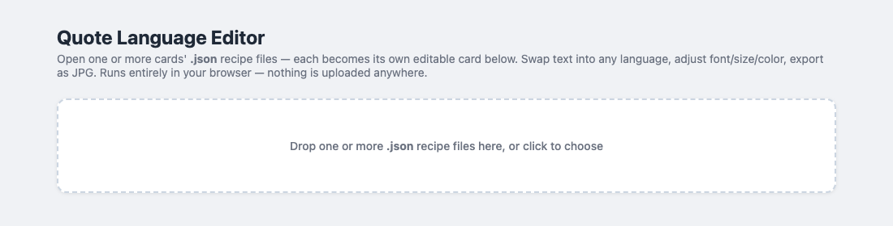
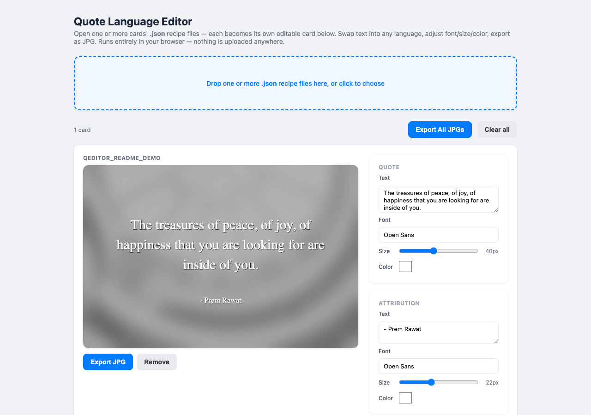

# Quote Language Editor

A static, browser-only app for swapping a quote card's text into another
language after the fact. Translators can either use the quotes already
preloaded for the current/upcoming week, or upload their own recipe JSONs —
whichever's convenient. Nothing is uploaded anywhere except through the
password-protected admin page.

Companion project: [`QuoteMaker_V3`](https://github.com/trystudios/QuoteMaker_V3)
generates the original English quote cards and, alongside each `.jpg`,
exports a `<name>.json` "recipe" file (the card's background image plus its
font/size/color styling). This app opens that recipe, lets you replace the
English text with another language, and re-exports the card as a JPG with
the same look.

## Live

Hosted at **https://quoteeditor.vercel.app** — just open that link, no setup
needed.

Deployed via the Vercel CLI under the `premrawatquotes@gmail.com` account
(project `prquotes/quoteeditor`) — not connected to GitHub, so the repo stays
private while the site itself is public.

**To redeploy after changing files here:** running `vercel` commands directly
from this folder can hang indefinitely — it's synced via OneDrive, and
OneDrive's on-demand file hydration seems to interfere with the CLI's own
file/auth handling. The reliable way is to copy the files to a plain local
folder first and deploy from there:

```bash
SCRATCH=/tmp/quoteeditor_deploy
rm -rf "$SCRATCH" && mkdir -p "$SCRATCH/api" "$SCRATCH/lib"
cp index.html app.js style.css data.html data.js weekdates.js fonts.js \
   fontpicker.js google-fonts-list.js package.json package-lock.json \
   vercel.json "$SCRATCH/"
cp api/weeks.js api/send-daily.js api/post-social.js "$SCRATCH/api/"
cp lib/*.js "$SCRATCH/lib/"
cd "$SCRATCH"
vercel link --project quoteeditor --yes   # first time only
vercel --prod --yes
```

(If any individual `cp` times out, just rerun it — OneDrive tends to succeed
on the second attempt once the file's hydrated.)

## Weekly quotes admin

**https://quoteeditor.vercel.app/data** — password-protected page for
uploading each week's recipe JSONs (from QuoteMaker_V3's Step 7 output). Pick
the week's Monday, drop the `.json` files, upload. Up to 20 files total can be
stored across all weeks at once — uploading more evicts the oldest stored
week first. Existing weeks can be deleted from the same page.

The homepage shows 4 week tabs — the previous week, the current/upcoming
week (selected by default), and the next 2 weeks — computed from today's
date, so it automatically rolls forward each Monday without needing a manual
update. Tabs for weeks with no uploaded data still show, just empty.

Files (both the drag-and-drop editor and the `/data` admin page) are always
sorted by the "`<Mon> <Day>`" name in their filename (e.g. "Sep 21"), not by
drop/upload order — this also correctly handles a week spanning two months
(e.g. Sep 29, Sep 30, Oct 1).

For each weekday, `/data` also has a **Youtube Link** field — the URL for
that day's "Un-change" header link — plus an auto-filled, editable link-text
field (fetched from the video's title via YouTube's oEmbed endpoint; edit it
if you want different wording). A checkbox mirrors Monday's link+text across
all 5 days, or uncheck it to set each day independently.

**Optional: drop the matching exported `.jpg` files** (same name as the
JSONs, e.g. "Sep 21.jpg") into the second dropzone on `/data`. If provided,
the daily email uses that exact image directly instead of re-rendering it
server-side — see "Daily email automation" below for why that matters.

## Daily email automation

A Vercel Cron job (`vercel.json`) hits `/api/send-daily` Monday–Friday at
**8:15 AM IST** (`45 2 * * 1-5` in UTC — IST has no DST, so this stays
accurate year-round). Each run:

1. Figures out today's date in IST and that week's Monday.
2. Loads that week's stored data (files + Un-change links) from `/data`.
3. Finds the recipe file matching today's date.

(Steps 1-3 live in `lib/week-data.js`, shared with the Facebook/Instagram
automation below — both pull the exact same day's data.)

4. Gets today's image — **prefers an uploaded `jpg_b64`** (the exact
   already-exported card) **over rendering** from the recipe JSON. The
   renderer (`lib/render-quote.js`, using `@napi-rs/canvas`) works, but has
   a known intermittent bug: under Vercel's warm-serverless-instance reuse,
   repeated back-to-back renders can occasionally register Google Fonts
   subsets incorrectly, producing tofu/box glyphs for specific characters.
   Providing the JPG sidesteps this entirely and is the recommended path;
   the renderer remains as a fallback for any day without one.
5. Builds the email (`lib/email-template.js`) and sends it via Gmail SMTP
   (`lib/gmail-send.js`, using an App Password — no OAuth/Cloud billing
   needed) to `DAILY_EMAIL_TO`.

**Required env vars** (set locally in `.env.local`, and in Vercel's project
settings for production — see `vercel env add`):

- `GMAIL_USER` — the sending Gmail address (e.g. `premrawatquotes@gmail.com`)
- `GMAIL_APP_PASSWORD` — a Gmail [App Password](https://myaccount.google.com/apppasswords)
  for that account (needs 2-Step Verification enabled first)
- `CRON_SECRET` — any random string; Vercel signs real cron requests with it
  automatically, and manual test calls need it as a `?secret=` query param
- `DAILY_EMAIL_TO` — the recipient (a Google Group address for production;
  point it at your own address while testing)

**Testing without waiting for the schedule:**

```bash
# Dry run - shows what would happen, sends nothing:
curl "https://quoteeditor.vercel.app/api/send-daily?date=2026-09-22&dryRun=1&secret=<CRON_SECRET>"

# Real send for a specific date:
curl "https://quoteeditor.vercel.app/api/send-daily?date=2026-09-22&secret=<CRON_SECRET>"
```

Both accept `?date=YYYY-MM-DD` to target any weekday, regardless of what
today actually is. The response includes `usedProvidedJpg` so you can
confirm whether a day used the uploaded JPG or fell back to rendering.

Note: Vercel's Hobby plan doesn't guarantee cron fires at the exact minute
(it can run up to ~59 minutes late) — check `vercel crons ls` or the
dashboard's Cron Jobs tab to confirm a run actually happened.

## Social media automation (Facebook + Instagram)

A second Vercel Cron job hits `/api/post-social` Monday–Friday at **6:00 PM
IST** (`30 12 * * 1-5` UTC). It reuses the same day-lookup + JPG-priority
logic as the email (`lib/week-data.js`), then posts that image to both:

- **Facebook** (`lib/facebook-post.js`) — direct multipart upload to the
  Page's `/photos` endpoint.
- **Instagram** (`lib/instagram-post.js`) — a two-step create-container-
  then-publish flow, since Instagram needs a public image URL rather than
  raw bytes (the image gets uploaded to Vercel Blob first either way, for
  this purpose).

The caption is a fixed hashtag block (`CAPTION` in `lib/facebook-post.js`)
— no quote text, since the image already shows it. Same caption on both
platforms. Each platform posts independently (a Facebook failure doesn't
block Instagram and vice versa — see the `facebookError`/`instagramError`
fields in the response).

**Credentials** live under a Meta Business Portfolio named **"Quote of the
Day"** (there's also an older, unused "Prem Rawat Quotes" portfolio +
app — ignore those). A Business Portfolio System User named "QuoteEditor"
has both the Facebook Page and the Instagram Business account assigned as
business assets, and its generated token (non-expiring) is used for both:

- `FB_PAGE_ID` — the Page's numeric ID
- `FB_PAGE_ACCESS_TOKEN` — the System User's token
- `IG_USER_ID` — the linked Instagram Business account's numeric ID
- `IG_ACCESS_TOKEN` — same value as `FB_PAGE_ACCESS_TOKEN` currently, kept
  as a separate env var in case they ever need to diverge

Getting a System User token permission to manage an Instagram account
requires first completing a one-time "Log in to Instagram for additional
settings" step in Business Settings — this is gated behind having *Full*
(not Partial) access to that Instagram account, so if this ever needs
redoing, check/upgrade your access level on the IG account first (Business
Settings → Accounts → Instagram accounts → Manage).

**Testing without waiting for the schedule** — same pattern as the email:

```bash
curl "https://quoteeditor.vercel.app/api/post-social?date=2026-09-22&dryRun=1&secret=<CRON_SECRET>"
curl "https://quoteeditor.vercel.app/api/post-social?date=2026-09-22&secret=<CRON_SECRET>"
```

## How to run it locally

No install, no build step for the static parts — it's plain HTML/CSS/JS. The
`/data` page's upload/delete does need the `/api/weeks` serverless function
and Vercel Blob storage, so use `vercel dev` (not a plain static file server)
to test that locally:

```bash
git clone https://github.com/trystudios/QuoteEditor.git
cd QuoteEditor
npm install
vercel dev
```

If you only need the main editor (drag-and-drop upload, no `/data` admin
page, no week tabs), any static file server works fine, e.g.
`python3 -m http.server 8899`.

## Features

- Week tabs on the homepage auto-select the current/upcoming week (see
  "Weekly quotes admin" above); manual drag-and-drop upload still works
  alongside them
- Load any number of `.json` recipe files at once — each becomes its own
  editable card, stacked on the page (e.g. a whole week's worth of cards)
- Independent text/font/size/color controls for the quote and its
  attribution
- Font picker searches the full Google Fonts catalog (~1942 families) with a
  live preview of each option rendered in its own font
- Automatic script-aware fallback (e.g. Noto Sans Devanagari, Noto Sans
  Arabic) if the chosen font is missing glyphs for the language you typed
- Export one card or all loaded cards as JPGs, named after their original
  date (e.g. `Jul 13.jpg`)
- A "Quote of the Day" email goes out automatically Mon-Fri at 8:15 AM IST,
  built from `/data`'s stored week (600px-wide image, header/footer links,
  the editable per-day Youtube Link) — see "Daily email automation" above
- The same day's quote also posts to Facebook and Instagram automatically
  Mon-Fri at 6:00 PM IST — see "Social media automation" above

## Usage guide (for non-technical users)

This is the walkthrough for someone receiving the app as a zipped folder
rather than using the live site directly — e.g. via a shared Google Drive
link. (In practice, most translators can just visit
https://quoteeditor.vercel.app/ directly and the current week's quotes are
already loaded — this manual flow is only needed for an offline copy or an
older/different set of quotes.)

> **Steps:**
>
> 1. Go to this link: https://drive.google.com/drive/folders/1t7JQDj5Coq6FIxQFwAfRETAJUjjSTbkc?usp=drive_link
> 2. Download the zip file in this link to your desktop or system.
> 3. Unzip the file.
> 4. Open the `index.html` file in this folder, which will open in a browser
>    like Chrome. It will look like this:
>
>    
>
> 5. Download the JSON zip file that gets sent along with the quotes every
>    week.
> 6. Unzip the JSON files.
> 7. Now upload these JSON files in the browser tab you opened in Step 4.
> 8. You can now see that the quotes are visible in English, and the text on
>    the right side is editable. It will look like this:
>
>    
>
> 9. Now you can simply edit the English text to the corresponding language
>    and adjust the font size and color if required.
> 10. Export the updated files as JPGs.
